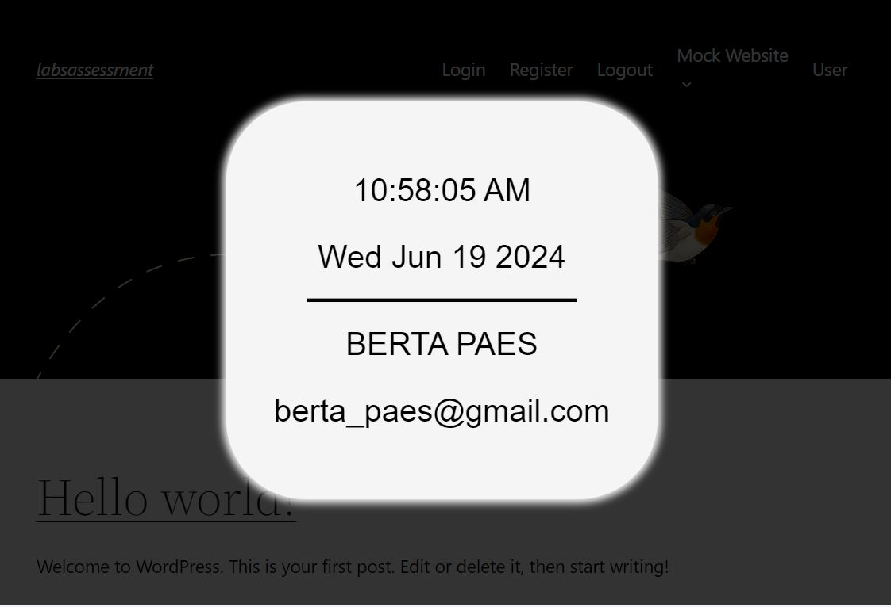

# Backend Code Assessment

This is a solution for the backend code assessment in a ongoing hiring process.

## Table of contents
- [Overview](#overview)
  - [The assessment](#the-assessment)
  - [Screenshot](#screenshot)
  - [Links](#links)
- [My process](#my-process)
  - [Steps taken](#steps-taken)
  - [Built with](#built-with)
- [Plugin details](#plugin-details)
  - [Installation](#installation)
  - [Usage](#usage)

- [Author](#author)

## Overview

### The assessment

Create a simple WordPress Plugin with the following jQuery functionalities:

- After a user is idle on any page/post for 10 seconds, display an overlay with a clock and the current date on the screen.
- If the user is logged into the WordPress site (using regular username/password credentials), display the user’s name and email address underneath the clock.

Additional details:
- Make use of HTML, JQuery and CSS.
- Add Readme file.
- Github incremental steps.

Optional tasks:
- Add any desired user interactions, e.g. a button to close the overlay, etc. 
- Store a database entry whenever an overlay is triggered.
- Add a way to force a user to login before they can view the site.

### Screenshot

### Links

- Github incremental steps: [https://github.com/DiegoIBH/labsassessment](https://github.com/DiegoIBH/labsassessment)

## My process

### Steps taken

1. In order to get started, I uploaded a plugin for user login/logout and registration. 
2. Created a directory and 2 files (PHP and JS) to test plugin being triggered correctly.
3. Update PHP and JS files, adding functionality (clock, reset triggers and update) in JS and localize function + hook in PHP.
4. Added conditional to show user information, created css file with styling for the overlay and enqueued styling file in PHP file
5. Checked for corrections, used html semantic structure for the overlay, added more comments to the code and looked in to responsiveness.
6. Included last optional task an reviewed the code and comments.
7. Curate the assessment, checked for possible improvements.

### Built with

Languages:
- Semantic HTML5
- CSS styling
- JavaScript
- PHP
Other tools:
- CMS: WordPress
- Library: jQuery
Approach: 
- Mobile-first

## Plugin details

### Installation

1. Download the zip file from the repository and unzip it.
2. Find the plugin directory `labsassessment\app\public\wp-content\plugins\my-micro-plugin` copy it and paste it within the  `\wp-content\plugins\` directory in own your project.
3. Go to the admin menu in WordPress site and check if it appears with in installed plugins.
4. Activate the plugin.

Extra requirements you would like to have in order to have full use of the plugin:

1. Install the "Ultimate Member" plugin, in order to preform registration, login and logout.
2. Once "Ultimate Member" is installed, go to  *settings -> access*  and change the "Global Site Access" to site accessible to logged in users and the "Custom Redirect URL" to the `/login/` URL, to force user login. 
3. Add class= "logged-in-only" or "logged-out-only" to the nav items you want to show when login and logged out.
4. Install "SQL Buddy" in order to visualize the db tables form within the menu *Tools -> SQL Buddy*

With these steps, the plugin should be already and running within your project.

### Purpose

The plugin is intended to be used in a WordPress site, in order to inform the user about an idle status while in the web and revert back to normal once he starts to use the website again. 

It provides extra information if the user is logged in and provides the site admin with database record of the user's idle concurrency, that he can then check on SQL Buddy plugin directly from his admin dashboard. 
